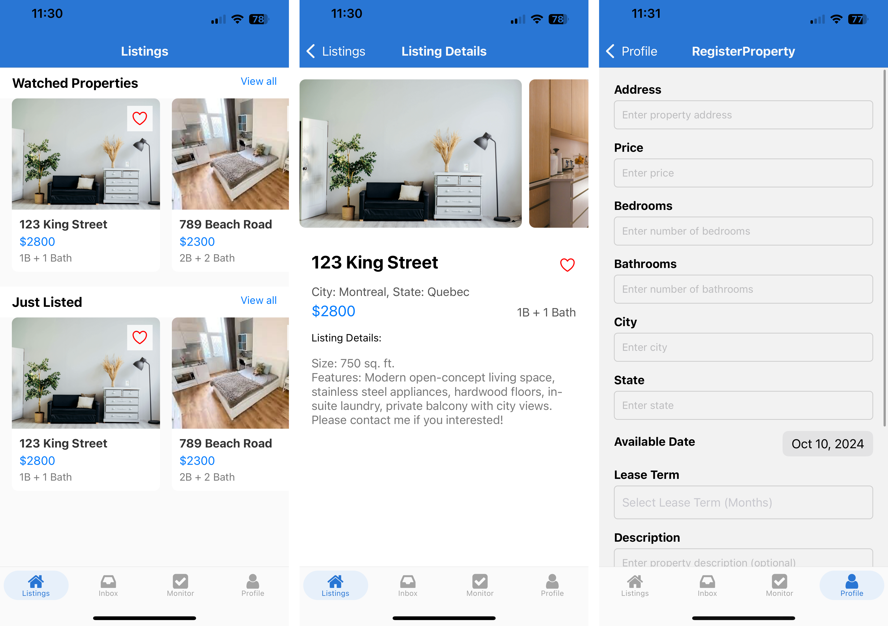
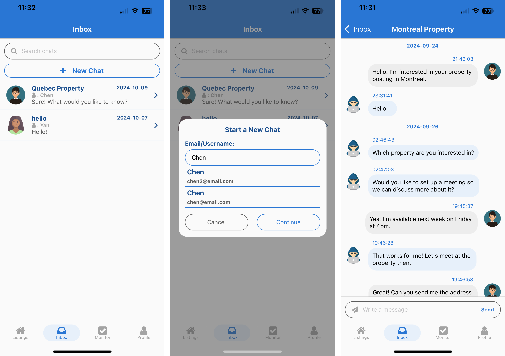
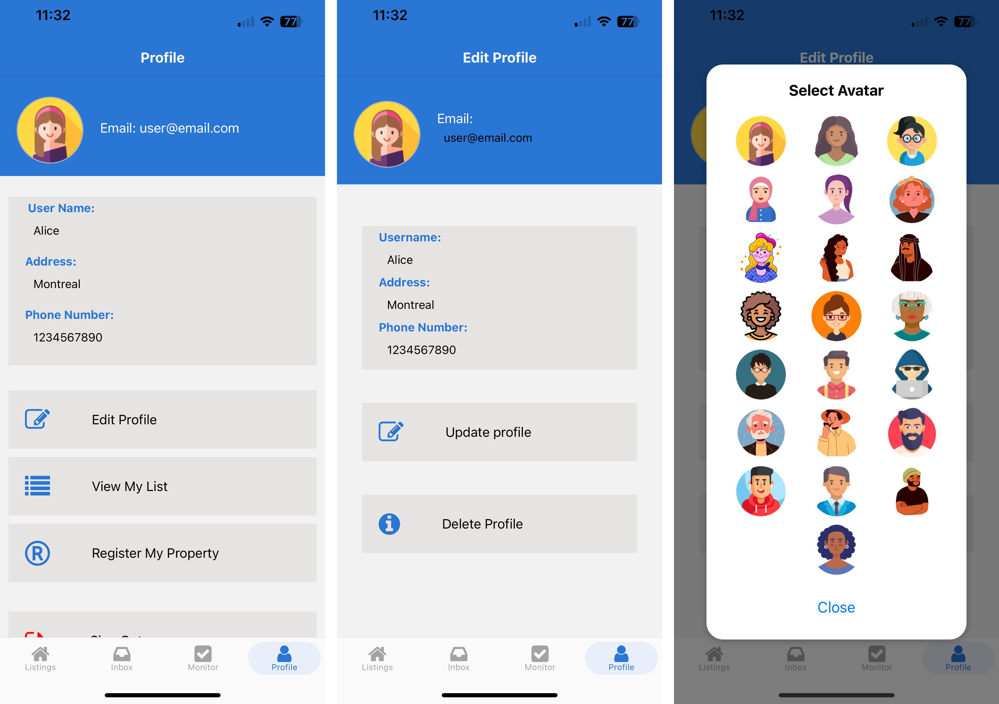
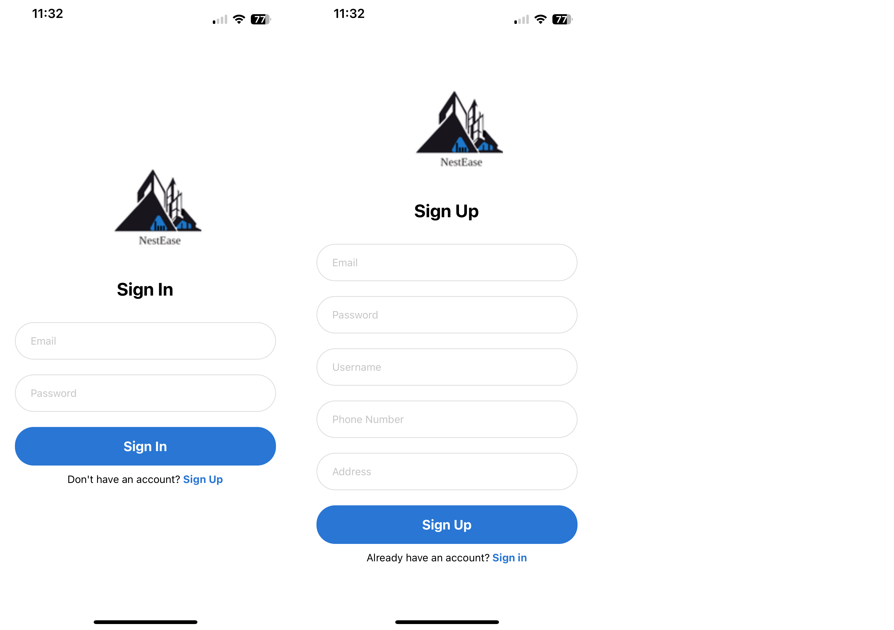

# RealEstateApp <!-- omit from toc -->

## Table of Content <!-- omit from toc -->

- [Description](#description)
- [Features of the Application](#features-of-the-application)
    - [Sign Up / Sign In](#sign-up--sign-in)
    - [Listings Tab](#listings-tab)
    - [Inbox Tab](#inbox-tab)
    - [Monitor Tab](#monitor-tab)
    - [Profile Tab](#profile-tab)
- [Technologies Used](#technologies-used)
- [Preview](#preview)

## Description

This project consists of building a real estate app to facilitate searching and posting properties for landlords and tenants. The app includes features such as listing and viewing properties, saving and monitoring properties, and chatting with other users about the properties. The app also includes user authentication using email and password and using Google account, and editing user profile.

## Features of the Application

The application is mainly made up of 4 tabs and the sign up/sign in pages.

#### Sign Up / Sign In

The app opens on the Sign In page if the user is not signed in. From that page, the user can navigate to the Sign Up page to create an account, or use the Google Sign In option.

#### Listings Tab

This is the homepage of the app, where all the listings for the properties are shown. The user can scroll to see all the listings, or click on a listing to go to the details page for that listing. In the details page, pictures of the property, the price, the number of rooms, and a description are shown. The user can save a listing to their monitor page to keep track of it.

#### Inbox Tab 

In the Inbox page, users can communicate with each other about properties they are interested in. The user can search up a user by username or by email to start a chat with.

#### Monitor Tab 

The monitor tab displays all the properties that the user saved from the listings page so that the user can easily keep track of properties they are interested in.

#### Profile Tab 

The Profile page displays the user's account email, username, addresss, and phone number. The user can also edit their profile information and select an avatar picture from the Edit Profile page. The Profile page also has a button leading to a form for adding properties for the user.   

## Technologies Used

* **React Native and Expo** are used for the frontend frameworks of the application, for building the frontend UI and logics.
* **Spring Boot** is used for the backend framework of the application, for writing the API endpoints and websockets.
* **Firebase Firestore** is used for the database, storing the application's data.
* **Firebase Storage** is used for storing the images used and uploaded in the application.
* **Firebase Authentication** is used for creating the user and authenticating the user for the sign up/sign in pages. 

## Preview

Here are some previews of the app: 

